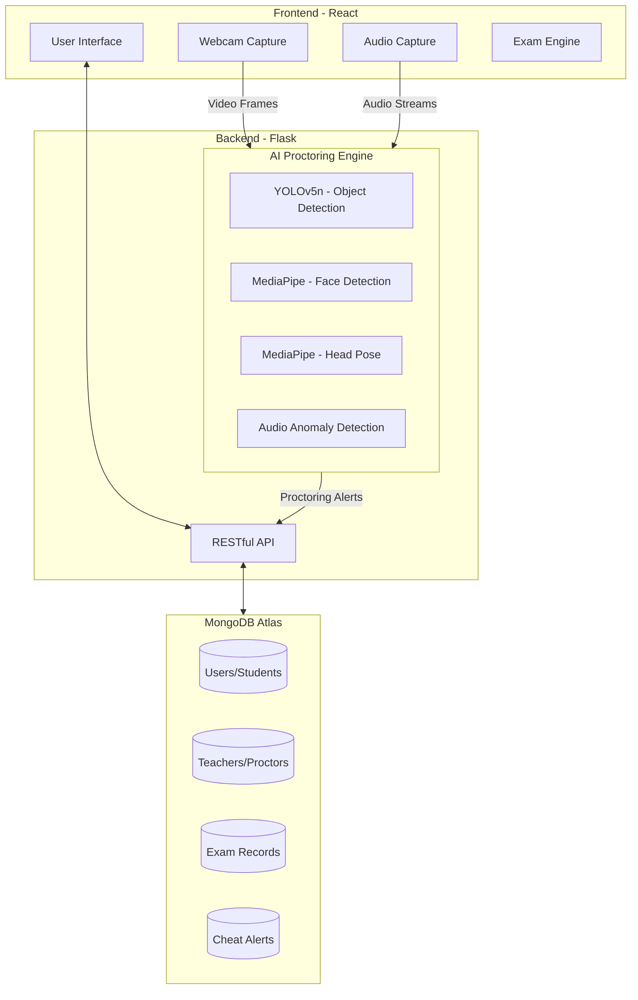
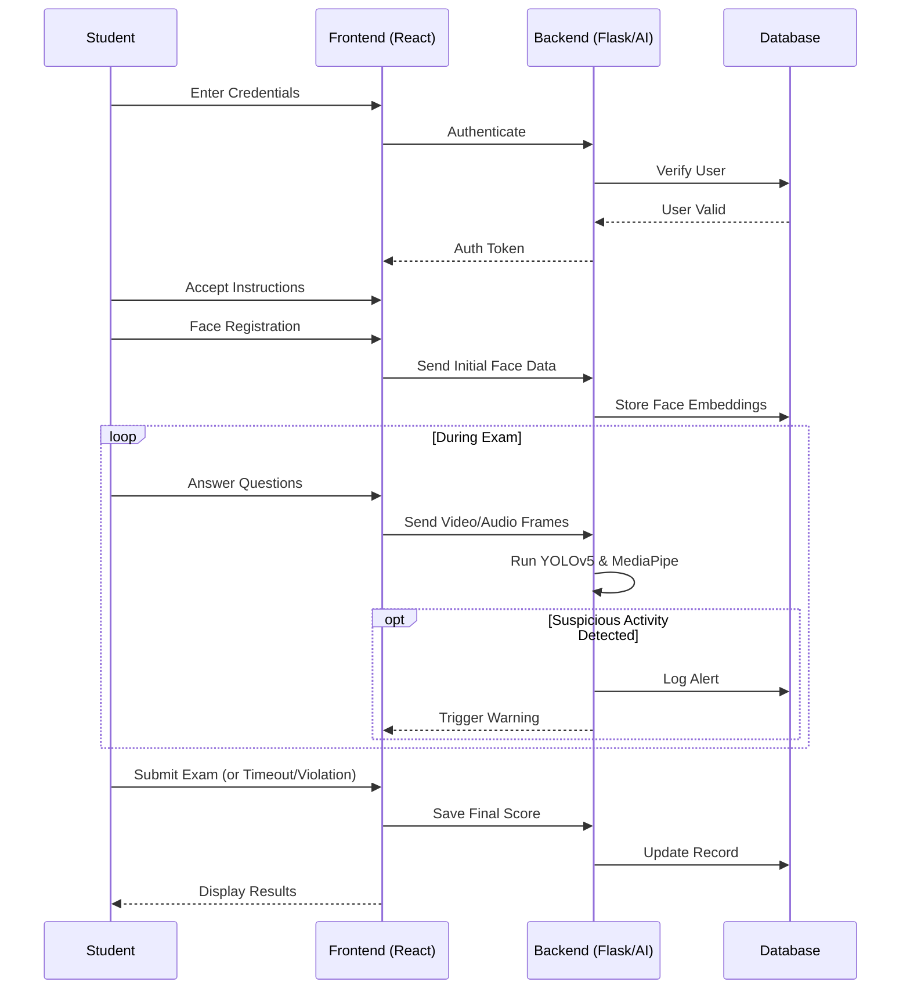
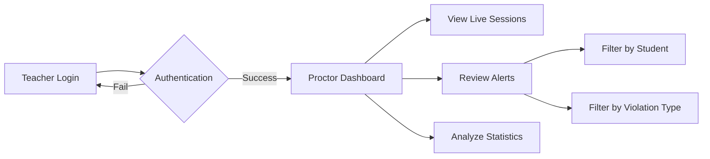

<h1 align="center">🕵️‍♂️ SecureExam AI</h1>

<div align="center">
  
  
  
  
  
</div>

<p align="center">
  <strong>A modern, AI-powered online exam proctoring system ensuring academic integrity through real-time object detection, head pose tracking, audio anomaly detection, and comprehensive analytics.</strong>
</p>

---

## 📋 Table of Contents

- [🌟 System Architecture](#-system-architecture)
- [🚀 Features in Detail](#-features-in-detail)
- [🔄 Workflows](#-workflows)
- [🛠 Tech Stack](#-tech-stack)
- [⚙️ Installation & Setup](#️-installation--setup)
- [🔧 Configuration](#-configuration)
- [🧪 Testing](#-testing)
- [📁 Project Structure](#-project-structure)
- [🔐 Authentication](#-authentication)
- [📄 Documentation & License](#-documentation--license)

---

## 🌟 System Architecture

SecureExam AI operates on a robust client-server architecture, leveraging edge-capable AI models and a highly responsive frontend to ensure seamless proctoring.



---

## 🚀 Features in Detail

### 🎓 Student Environment
- 👤 **Secure Authentication:** Roll number-based login with initial face registration.
- 📝 **Robust Exam Interface:** Real-time MCQ rendering, built-in timer, and seamless auto-submit capabilities.
- 🖥 **Environment Lockdown:** 
  - Fullscreen enforcement (auto-submits upon exit).
  - Keyboard restrictions (disables copy/paste, tab switching, and OS-level shortcuts).
- 🎥 **Continuous Webcam Proctoring:** Live identity verification checking for missing faces or multiple people.
- 🔍 **Advanced Head Pose Tracking:** Actively detects off-screen glancing (left, right, up, down).
- 🤳 **Real-time Object Detection:** Identifies forbidden objects like smartphones, laptops, and smartwatches.
- 🎤 **Audio Monitoring:** Employs advanced audio analysis to detect speech, whispering, and suspicious background noises.

### 👨‍🏫 Proctor / Teacher Dashboard
- 👨‍🏫 **Secure Access:** Role-based access control with robust MongoDB authentication.
- 📊 **Real-time Monitoring Center:** A live, websocket-ready dashboard providing an eagle-eye view of all ongoing exam sessions.
- 📈 **Visual Analytics:** Interactive charts (via Recharts) displaying alert distributions and cheating statistics.
- ⚠️ **Alert Triage System:** Filter, categorize, and review cheating alerts with detailed timestamps and event metadata.

---

## 🔄 Workflows

### Student Examination Flow



### Teacher Monitoring Flow



---

## 🛠 Tech Stack

### Frontend Ecosystem
- **Core:** React 19.1.0
- **Routing:** React Router DOM 7.6.3
- **Styling:** Bootstrap 5.3.7 for rapid, responsive UI development
- **Media:** React Webcam 7.2.0 for high-performance media capture
- **Visualizations:** Recharts 3.1.0 for dynamic data representation
- **Testing:** Jest & React Testing Library

### Backend Ecosystem
- **Core:** Flask 3.1.1 (Python 3.11+)
- **Security:** Flask-CORS 6.0.1 for secure cross-origin requests
- **Database:** MongoDB Atlas via PyMongo 4.6.1
- **Testing:** pytest 7.4.3 & pytest-flask 1.3.0

### AI & Machine Learning Pipeline
- **Object Detection:** [Ultralytics YOLOv5n](https://github.com/ultralytics/yolov5) (optimized nano model for real-time inference)
- **Computer Vision:** OpenCV 4.8.1.78
- **Biometrics & Tracking:** [Google MediaPipe](https://google.github.io/mediapipe/) (Face Detection & Face Mesh)

---

## ⚙️ Installation & Setup

### Prerequisites
- **Python:** `3.11+`
- **Node.js:** `18+`
- **Database:** MongoDB Atlas account (or a local MongoDB instance)

### 1. Clone the Repository
```bash
git clone https://github.com/your-username/SecureExam-AI.git
cd SecureExam-AI
```

### 2. Backend Setup
```bash
cd backend

# Create and activate virtual environment
python -m venv ../.venv

# On Windows:
..\.venv\Scripts\activate
# On Mac/Linux:
source ../.venv/bin/activate

# Install dependencies
pip install -r requirements.txt
```
*Note: The YOLOv5n model (~5.3MB) will automatically download upon the first execution.*

### 3. Frontend Setup
```bash
cd ../frontend

# Install Node modules
npm install
```

### 4. Database Configuration
Update the MongoDB URI in `backend/app.py` (Line 15):
```python
# Replace with your actual connection string
MONGO_URI = "mongodb+srv://<username>:<password>@cluster.mongodb.net/test"
```
*Tip: For production environments, utilize environment variables (`python-dotenv`) instead of hardcoding credentials.*

---

## 🔧 Configuration

### Backend Environment
- **Port:** Default `5000` (configurable in `app.py`)
- **CORS Policies:** Currently permissive for `localhost:3000`. **Must be tightened for production.**
- **AI Models:** Located in the `backend/` directory (`yolov5n.pt`).

### Frontend Environment
- **API Endpoint:** Default `http://localhost:5000`. Update API utility configurations when deploying to the cloud.
- **Port:** Default `3000`.

---

## 📚 Usage Guide

### Starting the System

1. **Launch the Backend API:**
   ```bash
   cd backend
   # Ensure your .venv is activated
   python app.py
   ```
   *Runs on `http://localhost:5000`*

2. **Launch the Frontend Application:**
   ```bash
   cd frontend
   npm start
   ```
   *Runs on `http://localhost:3000`*

---

## 🔐 Authentication

### Pre-configured Teacher Accounts
*These are created automatically in the database for testing purposes.*

| Username | Password | Role |
| :--- | :--- | :--- |
| `admin` | `SecureAdmin2026!` | Administrator |
| `teacher` | `TeacherPass2026!` | Teacher |
| `proctor` | `ProctorPass2026!` | Proctor |

### Pre-configured Student Account

| Field | Value |
| :--- | :--- |
| Username | `test_student` |
| Roll Number | `12345` |
| Password | `password123` |

*(Note: Passwords are in plain text for development. Production deployments must implement bcrypt/Argon2 hashing.)*

---

## 🧪 Testing

The project maintains high reliability through comprehensive automated testing.

### Backend Suite (20/20 Passing)
```bash
cd testing/backend
pytest
# For coverage reporting:
pytest --cov=app --cov-report=html
```

### Frontend Suite
```bash
cd frontend
npm test
# For coverage reporting:
npm test -- --coverage --watchAll=false
```

---

## 🚀 Deployment Guide

### Backend Deployment (Render / Heroku / Cloud)

1. **Prepare for Production:**
   - Use `gunicorn` as the WSGI HTTP Server.
   - Install `gunicorn`: `pip install gunicorn` and add it to `requirements.txt`.
   - Ensure CORS is configured properly in `app.py` for your production frontend URL.
2. **Environment Variables:**
   - Set `MONGO_URI` to your MongoDB Atlas connection string.
   - Ensure the server runs on `0.0.0.0` and listens to the `PORT` environment variable provided by your host.
3. **Run Command:**
   ```bash
   gunicorn app:app --bind 0.0.0.0:$PORT
   ```

### Frontend Deployment (Vercel / Netlify)

1. **Configure API Endpoint:**
   - Change the API URL in your components to point to your deployed backend URL instead of `http://localhost:5000`. This is best done via an environment variable (e.g., `REACT_APP_API_URL`).
2. **Build the Application:**
   ```bash
   npm run build
   ```
3. **Deploy:**
   - Connect your repository to Vercel or Netlify.
   - Set the build command to `npm run build` and the output directory to `build/`.
   - Set the `REACT_APP_API_URL` environment variable in your hosting dashboard.

---

## 📁 Project Structure

```text
SecureExam-AI/
├── backend/
│   ├── app.py                    # Core Flask API & MongoDB Logic
│   ├── requirements.txt          # Python dependencies
│   └── yolov5n.pt                # Object detection weights
│
├── frontend/
│   ├── public/                   # Static assets
│   ├── src/
│   │   ├── components/           # Reusable React components (Exam, Login, Protected Routes)
│   │   ├── pages/                # High-level views (Dashboard, Teacher Login)
│   │   ├── utils/                # Helper functions (Keyboard restrictors, API clients)
│   │   ├── App.js                # Main router
│   │   └── index.js              # Entry point
│   └── package.json
│
├── testing/                      # Centralized testing environment
│   ├── backend/                  # Pytest suite
│   └── frontend/                 # Jest / RTL suite
│
├── FEATURES.md                   # Detailed feature documentation
├── TESTING.md                    # Comprehensive QA guide
├── QUICK_TEST_GUIDE.md           # Cheat-sheet for testing
├── IMPLEMENTATION_SUMMARY.md     # Development changelogs
└── README.md                     # You are here
```

---

## 📄 Documentation & License

### Deep Dives
- 📖 **[FEATURES.md](FEATURES.md)** - Exhaustive list of capabilities and API schema.
- 🔬 **[TESTING.md](TESTING.md)** - Detailed test methodologies.
- 📝 **[IMPLEMENTATION_SUMMARY.md](IMPLEMENTATION_SUMMARY.md)** - Architectural decisions and patch notes.

### License
This project is licensed under the **[MIT License](LICENSE)**.

---

## 🙏 Acknowledgments & Support

- Powered by **[Ultralytics YOLOv5](https://github.com/ultralytics/yolov5)** for lightning-fast object detection.
- Facial biometrics handled by **[Google MediaPipe](https://google.github.io/mediapipe/)**.
- If you encounter issues, please open a ticket on **[GitHub Issues](https://github.com/your-username/SecureExam-AI/issues)**.

<p align="center">
  <i>Developed with ❤️ for secure, accessible online education.</i>
</p>
